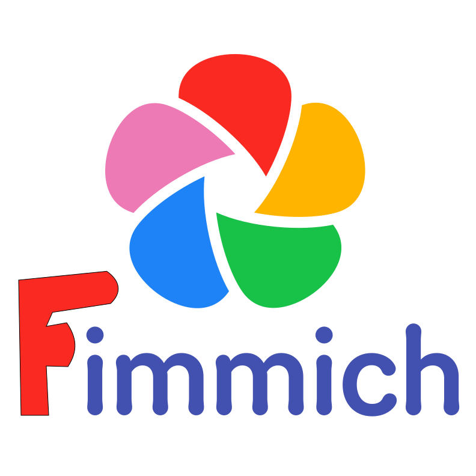

 
   
  
  
   
   

<h3 align="center">High performance self-hosted photo and video management solution a Family oriented branch of the fantastic Immich software</h3>
 

## What is this all about?

Immich is a fantastic photo management and gallery software! For my use, however, it is lacking in one key use case: A family with a large
shared photo collection who want's to share the burden of tagging faces.  For years(?) the Immich team has had this on the roadmap without any
(visible) progress. This fork is me growing tired of waiting.

### How this fork changes Immich
This fork takes a heavy handed approach: Person objects and face embeddings are made global. Further the partner of a partner share is given elevated
privileges, basically rendering the image collection truly shared.

### The result
User A has enabled partner sharing to user B

Faces tagged by user A are immediately visible to user B. user B can change the tagging, tag new faces and merge
their own persons/faces with the persons in the shared library.  Privacy is still preserved. user B's photos are not visible to user A.

Additionally user B can delete and archive the shared photos. They will always be archived, though, so user A can review the deletes. 
User B can not see user A's archived photos.

### Recommended setup
If the users want to maintain a shared and a private collection, it is recommended to have a common "shared account" that owns the
shared photos. Typically configured with an external library.

### todo / unsolved.
- When a face/person object is created in user B's account the ownership should be set to user A on maintain all users visibility of the person in 
search etc. Patches accepted.

- I would like to enable sharing of Stacks/duplicate overview too.

## The future
This fork is hopefully short lived. I can only hope the Immich team will prioritize this use case soon. Until then, I will irregularily port this fork
to the latest release.

## Security
I don't have the time to follow the Immich releases closely. Security issues in Immich may exists for a long time before this fork is updated.
**DO NOT EXPOSE THIS FORK ON THE INTERNET**

> [!WARNING]
> ⚠️ Always follow [3-2-1](https://www.backblaze.com/blog/the-3-2-1-backup-strategy/) backup plan for your precious photos and videos!
> 
 

> [!NOTE]
> You can find the main documentation, including installation guides, at https://immich.app/.

## Links

- [Documentation](https://docs.immich.app/)
- [About](https://docs.immich.app/overview/introduction)
- [Installation](https://docs.immich.app/install/requirements)
- [Roadmap](https://immich.app/roadmap)
- [Demo](#demo)
- [Features](#features)
- [Translations](https://docs.immich.app/developer/translations)
- [Contributing](https://docs.immich.app/overview/support-the-project)

